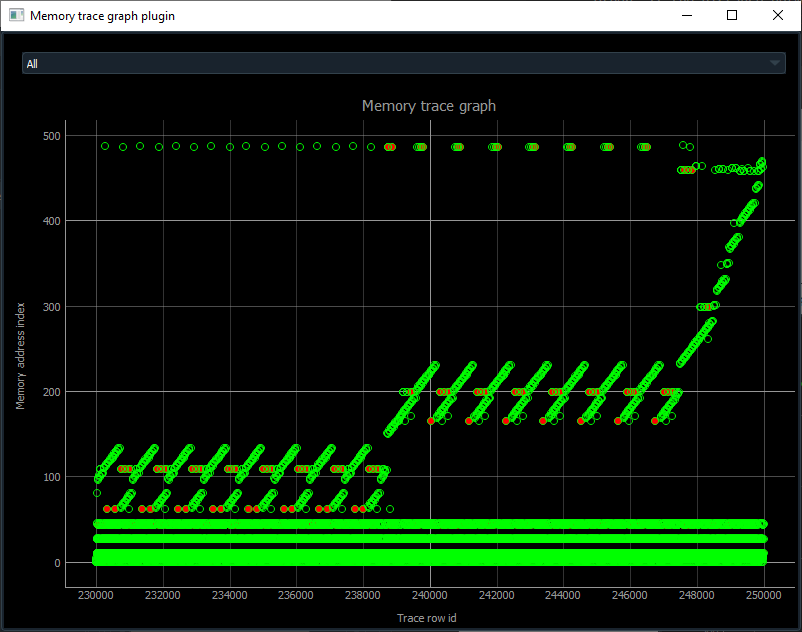

# Memory Trace Plugin

This plugin visualizes memory accesses of an execution trace.

Here is a screenshot of some loops inside Subleq VM:



x-axis is a row in trace, y-axis is an index in a list of memory addresses. Green circle is a memory read, red circle is a write. You can click a circle to go to that row in trace.

User is asked one value: max_distance. It is used to separate addresses which are far from each other. If the distance between 2 consecutive memory addresses is > max_distance, memory index will increase by max_distance. Else the index will increase by 1. In some cases smaller max_distance gives a more detailed graph.

## Dependencies

- [Execution Trace Viewer](https://github.com/teemu-l/execution-trace-viewer)
- [PyQtGraph](http:/http://pyqtgraph.org)

```shell
pip install pyqtgraph
```
